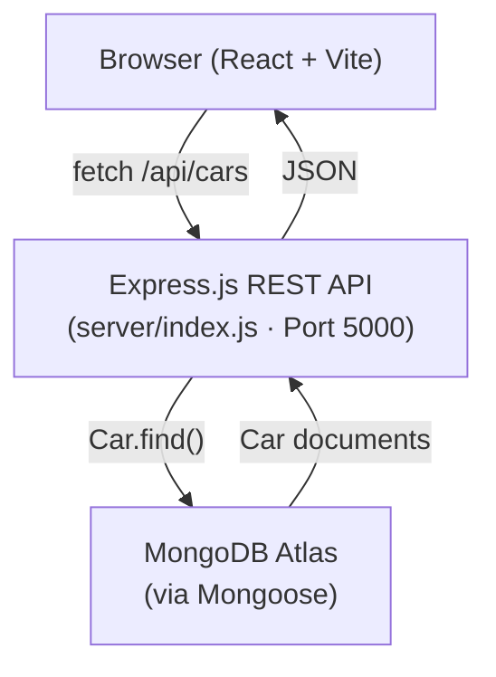

# 🚗 The Lux Motors — Project Overview

> A premium, full-stack luxury car dealership web application.

---

## 🏗️ Architecture



**Monorepo-style layout:**
- `/` — Frontend (React + Vite, runs on port 5173)
- `/server` — Backend (Express.js + Mongoose, runs on port 5000)

---

## ⚙️ Tech Stack

| Layer | Technology |
|---|---|
| Frontend Framework | React 19 + Vite 8 |
| Routing | React Router DOM v7 |
| Styling | TailwindCSS v4 + Stitches/React |
| Animations | Framer Motion |
| Icons | Lucide React |
| Backend | Express.js (Node.js) |
| Database | MongoDB (via Mongoose) |
| Fonts | Playfair Display, Montserrat, Cormorant Garamond |

---

## 📄 Pages (3 Routes)

### 1. `/` — Homepage
The main showroom page. Composed of **8 sections** assembled in `Homepage.jsx`:

| Section Component | What it does |
|---|---|
| `Header` | Navigation bar with "Book Test Drive" trigger |
| `HeroSection` | Full-screen auto-sliding car image slideshow (5 slides) |
| `StatsSection` | Static stats display (e.g. fleet size, years, etc.) |
| `MarqueeStrip` | Scrolling brand/text ticker strip |
| `CategoriesSection` | Browse cars by category (Vintage, Sports, Sedan…) |
| `FeaturedSection` | Grid of featured/highlighted cars from DB |
| `ExperienceSection` | Brand lifestyle/experience storytelling section |
| `TestDriveCTA` | Full-width CTA to book a test drive or WhatsApp dealer |
| `Footer` | Site footer |
| `BookingModal` | Modal popup for test drive scheduling (triggered by CTA / header) |

### 2. `/models` — Category Page (`CategoryPage.jsx`)
- Fetches **all cars** from MongoDB on mount
- Filter tabs: `All`, `Vintage`, `Sports`, `Sedan`, `Adventure`, `Ultra Luxury`
- Active filter synced to URL `?category=Sports` (shareable links)
- Renders car grid via `<CarCard />` component

### 3. `/login` — Admin Login (`LoginPage.jsx`)
- Split-screen layout: decorative car image (left) + form panel (right)
- Client-side validation (email format, min password length)
- Gold shimmer submit button with animated spinner
- Shake animation on validation error
- **Currently mocked** — navigates to `/admin/dashboard` after fake 1.8s delay (no real auth)

---

## 🔌 Backend API (`/server`)

### Server (`server/index.js`)
- Express app on **port 5000**
- Connects to MongoDB via `MONGO_URI` in `.env`
- CORS allowed for `localhost:5173` and `localhost:3000`
- Health check: `GET /health`

### Mongoose Model (`Car.js`)
```js
{
  name, brand, category, year, description,
  engine, top_speed, acceleration, seats,
  fuel_type, price_display, price,
  images: [String],
  is_featured: Boolean
}
```

### API Routes (`/api/cars`)
| Endpoint | Description |
|---|---|
| `GET /api/cars` | All cars (supports `?featured=true` and `?category=Sports` filters) |
| `GET /api/cars/:id` | Single car by MongoDB `_id` |

---

## 🪝 Frontend Data Layer

### `src/api/cars.js`
Thin fetch wrapper with a `normalizeCar()` function that maps raw MongoDB field names (e.g. `top_speed`, `is_featured`) to camelCase frontend shapes.

Functions: `fetchAllCars()`, `fetchFeaturedCars()`, `fetchCarById()`, `fetchCarsByCategory()`

### `src/hooks/useCars.js`
Custom React hook used by `Homepage.jsx`:
- Runs `fetchAllCars()` and `fetchFeaturedCars()` **in parallel**
- Falls back to first 6 of all cars if no featured exist
- Returns `{ allCars, featuredCars, loading, error }`

### `src/hooks/useReveal.js`
Scroll-triggered reveal animation hook — activates once data has loaded.

---

## 🎨 Design System

- **Color Palette:** Black backgrounds (`#080808`, `#0f0f0f`), gold accents (`#bda588`, `#e9c176`, `#C9A84C`), cream text (`#f3f4f6`, `#F5F0E8`)
- **Typography:** Playfair Display (headings/serif), Montserrat (body/labels), Cormorant Garamond (login page)
- **Effects:** Film grain overlay (CSS SVG noise), glassmorphism cards, gradient overlays on hero images
- **Animations:** Framer Motion transitions, shimmer buttons, slide fade transitions (1s), scroll reveal

---

## ⚠️ Current Status & Known Gaps

| Area | Status |
|---|---|
| Hero Slider | ✅ Works — uses DB cars (top 5 featured) or static fallback |
| Categories Page | ✅ Works — fetches from API, filterable by URL param |
| Featured Section | ✅ Works — pulls `is_featured` cars from MongoDB |
| Backend API | ✅ Implemented — GET all + GET by ID |
| MongoDB Model | ✅ Defined with all fields |
| Admin Login | ⚠️ **Mock only** — no real auth, redirects to `/admin/dashboard` which doesn't exist |
| Test Drive Booking Modal | ⚠️ UI exists but form submission likely not wired to backend |
| Car Detail Page | ❌ **Missing** — Hero links to `/car/:id` but no route/page exists |
| Admin Dashboard | ❌ **Missing** — login redirects to `/admin/dashboard` but route not defined |
| Auth / JWT | ❌ **Not implemented** |
| Car CRUD (Admin) | ❌ **Not implemented** — no POST/PUT/DELETE endpoints |

---

## 🚀 How to Run

**Frontend:**
```bash
# In project root
npm run dev        # → http://localhost:5173
```

**Backend:**
```bash
# In /server
npm run dev        # or: node index.js → http://localhost:5000
```

> Make sure `server/.env` has `MONGO_URI=...` set before starting the backend.
